# KuaiRand-Pure 项目分析报告

这份文档用于快速展示项目背景、各阶段分析过程、主要图表和核心结论。SQL 建表与指标计算细节见 `../sql/`，Python 分析与建模代码见 `../notebooks/01_kuairand_pure_analysis.ipynb`。


---

# 0. 项目背景与分析目标

## 数据集背景

KuaiRand 是基于快手推荐日志构建的公开推荐数据集。根据官方说明，该数据集同时提供了正常推荐产生的交互日志，以及在正常推荐过程中加入随机干预后产生的交互日志。
可以简单理解为：

- `standard`：正常推荐产生的曝光记录；
- `random`：随机干预产生的曝光记录。在随机曝光阶段，原本要展示的推荐视频有一定概率被随机抽取的视频替换。

KuaiRand 官方提供了多个不同的数据集版本，本项目选择其中的 KuaiRand-Pure 进行分析。该数据集包含 27,285 名用户和 7,583 个视频，同时提供正常推荐和随机干预两类日志。
官方数据说明：
[KuaiRand 官方 GitHub](https://github.com/chongminggao/KuaiRand)

## 数据组成与时间划分

KuaiRand-Pure 中包含用户交互日志以及用户、视频相关的基础信息。本项目共使用 6 个原始数据文件，包括：
- 3 份用户—视频交互日志，分别对应不同时间阶段和曝光方式；
- 1 份用户特征表；
- 1 份视频基础特征表；
- 1 份视频历史统计表。

其中，三份交互日志分别为：
```text
standard_pre
2022-04-08 ～ 2022-04-21
→ 历史正常推荐日志（用于构建用户、视频和作者的历史特征与分层）

standard_post
2022-04-22 ～ 2022-05-08
→ 后期正常推荐日志（用于进行同期曝光方式比较）

random_post
2022-04-22 ～ 2022-05-08
→ 后期随机干预曝光日志（用于进行同期曝光方式比较）
```
从时间上看，standard_pre 属于前期历史窗口，standard_post 与 random_post 属于后期窗口。

## 项目目标

基于上述数据，本项目主要完成四部分工作：

```text
原始数据理解与 ODS / DWD / DWS 分层数仓建设
→ 用户历史画像、视频标签偏好与用户分层
→ 视频 / 作者历史曝光、观看互动表现分析与分层
→ standard / random 视频曝光分配和用户反馈差异分析
→ long_view 行为预测
```

项目重点关注：

1. 用户、视频和作者在历史窗口中的曝光、观看和互动特征分别呈现出什么特点；
2. standard 与 random 两种曝光来源下，实际展示的视频结构有什么不同；
3. 对于同一批用户和同一批视频，两种曝光来源下的观看和互动反馈有什么差异；
4. 上述反馈差异在不同历史用户类型和历史视频类型中是否保持一致；
5. 基于用户和视频的历史特征，能在多大程度上预测一次 standard_post 曝光是否产生 long_view。

---

# 1. Phase 1｜原始数据理解与质量检查

### 1）分析内容

Phase 1 首先对 6 个原始文件进行整体检查：

- 每张表一行代表什么；
- 字段类型和关键字段含义；
- 有无缺失值、重复值和异常值；
- 原始观看与互动字段是否符合项目后续分析需要。

### 2）主要结果

- 核对了三张推荐日志表的时间范围和曝光方式；
- 明确了各表之间的关联关系；
- 根据官方文档中对 long_view 等观看行为字段的定义和计算规则，对原始字段进行核对，并在 DWD 层按照统一规则重新计算，保证后续各阶段使用一致的指标口径。

Phase 1 的主要作用是先把数据结构和字段含义确认清楚，再进入正式建表和分析。

---

# 2. Phase 2｜ODS → DWD → DWS 分层数仓建设

### 1）ODS：原始数据入库

- 将 6 个原始 CSV 导入 MySQL，保留原始字段和原始取值，后续清洗和指标计算不直接修改原始数据。
> SQL 代码：[`01_Phase2_ODS.sql`](../sql/01_Phase2_ODS.sql)

### 2）DWD：数据清洗

- 对字段的异常项进行处理（重复值、缺失值、异常值等）；
- 统一日期、时间字段格式；
- 重新计算有效观看、长播放和完播等基础观看标签；
- 合并三张日志表形成 exposure_log，便于后续分析；
> SQL 代码：[`02_Phase2_DWD.sql`](../sql/02_Phase2_DWD.sql)

### 3）DWS：构建核心指标

在 exposure_log 基础上，分别按照不同粒度：

```text
user_id × log_source
video_id × log_source
author_id × log_source
```
汇总并构建核心曝光、观看、互动行为指标：

- 曝光次数；
- 去重曝光视频数、去重触达用户数等曝光规模指标；
- 有效观看、长播放、完播次数；
- 总播放时长；
- 点赞、评论、转发、主页进入、关注、点踩次数；
- 对应观看率和互动率。

> SQL 代码：[`03_Phase2_DWS.sql`](../sql/03_Phase2_DWS.sql)
> 
---

# 3. Phase 3｜用户历史画像与分层
从 Phase 2 汇总结果中筛选 `standard_pre` 历史窗口的用户数据，分析用户的活跃情况、曝光规模、观看互动表现和视频标签偏好，并进行用户历史分层。
> SQL 代码：[`04_Phase3_ADS_user_profile.sql`](../sql/04_Phase3_ADS_user_profile.sql)
> 
### 1）用户历史活跃与曝光规模

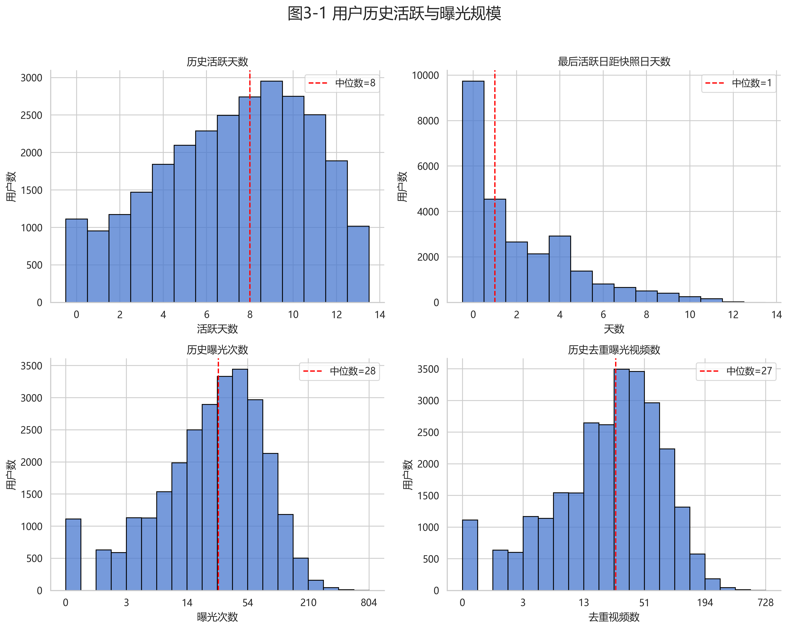
- 全量用户共 27285 人，其中约 95.9% 在历史窗口中存在曝光记录。
- 用户历史活跃度较高：活跃天数中位数为8天，最近一次活跃距快照日中位数仅1天。
- 不同用户的历史曝光次数差异较大：历史曝光次数中位数28次，同时存在明显长尾分布。低曝光次数用户计算观看率、互动率时容易受少量行为放大，因此后续需要设置最低曝光次数门槛后再分析行为表现。
---

### 2）历史观看与互动反馈
由于曝光次数很少时，1～2 次行为就可能产生非常极端的行为率，因此使用有历史曝光用户的曝光次数 P30 作为最低观测门槛，再分析观看和互动表现。

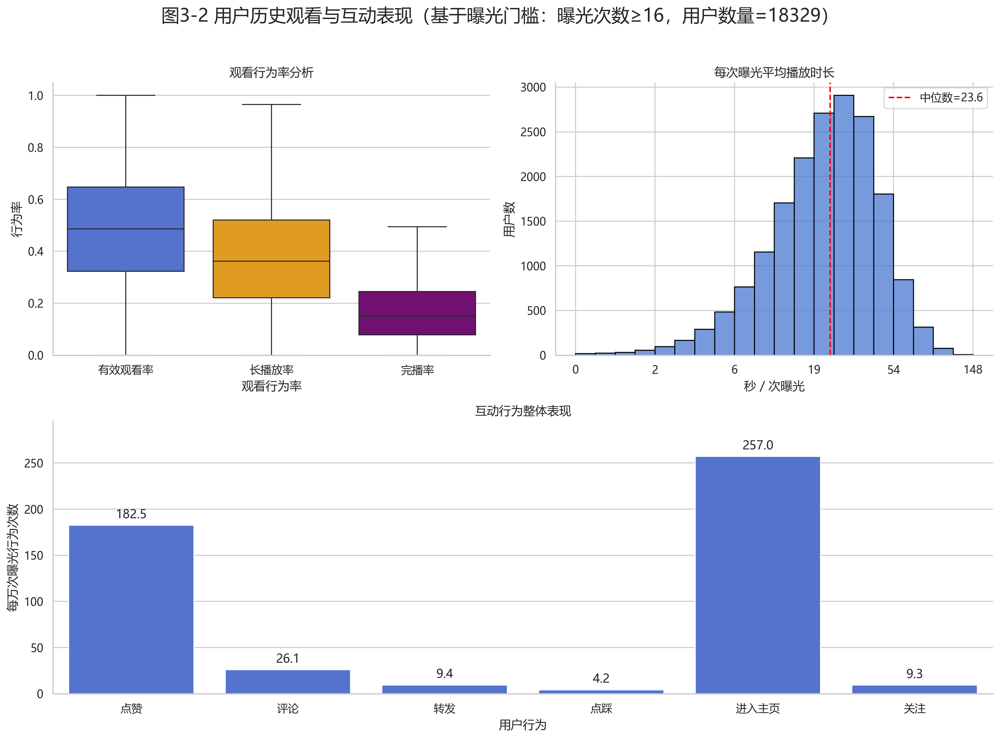
- 以16次历史曝光作为最低观测门槛后，共18329名用户进入正式表现分析，占有曝光用户70.0%，在保留多数用户的同时减少低样本率指标波动；
- 有效观看率、长播放率和完播率中位数依次为48.6%、35.9%和15.0%，随观看要求加深明显下降；
- 互动行为明显比观看行为稀疏，且主要集中在主页进入和点赞。转发、关注和点踩发生频率很低。
---

### 3）用户视频标签偏好结构

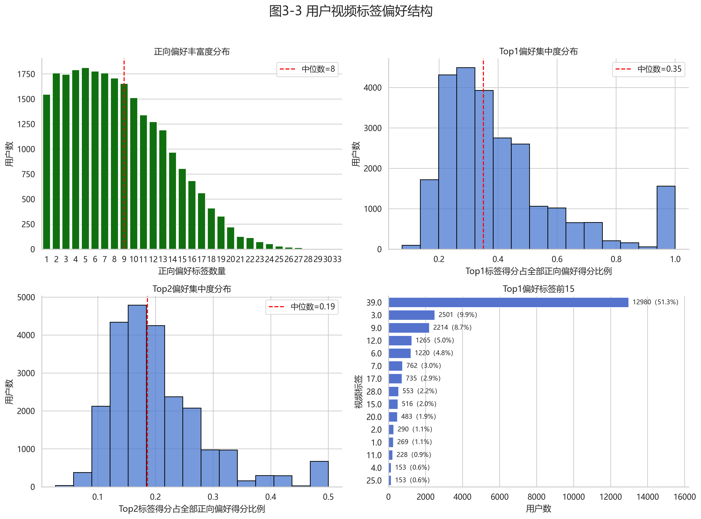
- 用户偏好画像覆盖率较高：92.8%的全量用户拥有至少1个正向偏好标签，且93.9%的正向偏好用户具有Top2偏好；
- 用户正向偏好标签数中位数为8个，Top1偏好仅占正向偏好总得分的35%，Top2偏好占比中位数为19%，说明多数用户具有多标签偏好，而非集中于单一标签。
- 历史曝光用户中96.66%的净偏好得分大于0，3.30%等于0，仅10名用户（0.0382%）小于0，整体负向净偏好极少；
- 匿名标签39覆盖51.3%的Top1偏好用户，集中度较高。

### 4）历史用户分层
基于历史窗口中的活跃强度与用户反馈强度构建二维行为分层。
- 首先以历史曝光用户曝光次数的P30作为最低观测门槛，筛选正式分层样本，其余用户保留为低曝光次数或零曝光类型；
- 使用历史活跃天数与历史曝光次数衡量用户活跃强度，使用观看行为与互动行为衡量用户反馈强度（将对应字段进行赋分）；
- 分别计算active_score与feedback_score，并采用其P70作为高水平分层切点，将正式分层用户划分为四种类型。

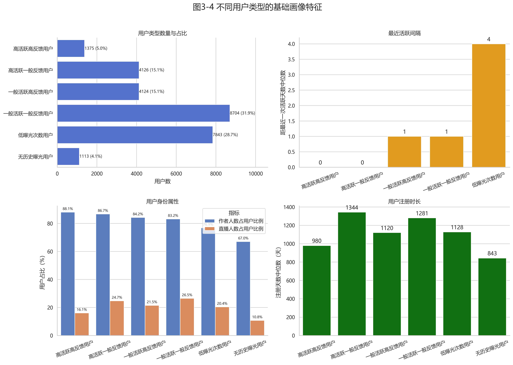
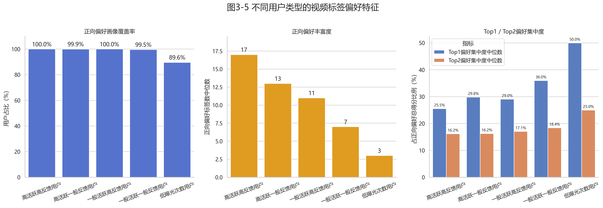
- 6类用户中，一般活跃一般反馈用户和低曝光次数用户占比最高（31.9%），无历史曝光用户占比最低（4.1%），高活跃高反馈用户占比也较低（5.0%）；
- 高活跃用户最近活跃间隔中位数为0天，一般活跃用户约为1天，低曝光次数用户为4天，不同历史用户类型在近期活跃程度上有明显差异；
- 高活跃高反馈用户的正向偏好标签数中位数为17个、Top1集中度为25.6%；低曝光次数用户正向偏好标签数中位数为3个、Top1集中度为50.0%。高活跃高反馈用户视频标签偏好更分散，而低曝光次数用户的视频标签偏好更集中。
---

### 5）Phase 3 结论

Phase 3 最终完成了：

- 用户历史活跃、曝光、观看和互动特征整理；
- 用户视频标签偏好分析；
- 用户历史状态分层。

这些结果一方面用于描述用户历史行为，另一方面为 Phase 5 的分层比较和 Phase 6 的历史用户特征提供基础。

---

# 4. Phase 4｜视频与作者历史分析
从 Phase 2 汇总结果中筛选 `standard_pre` 历史窗口的视频和作者数据，分析视频与作者的供给情况、曝光覆盖、曝光集中度、观看互动表现，并进行历史分层。
> 对应 SQL：[`05_Phase4_ADS_video_author_history.sql`](../sql/05_Phase4_ADS_video_author_history.sql)

## 视频侧

### 1）视频供给与历史曝光

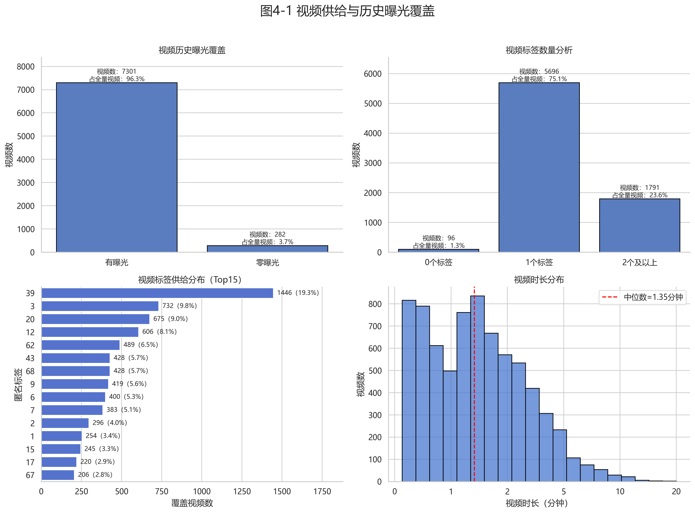
- 视频历史曝光和视频标签覆盖率较高：全量7583个视频中96.3%获得过历史曝光，98.7%具有标签；
- 标签结构分布较稀疏：全量视频75.1%的视频只有1个标签，且匿名标签39出现最频繁；
- 视频时长中位数为1.35分钟，整体以短视频为主。

### 2）视频历史曝光集中度

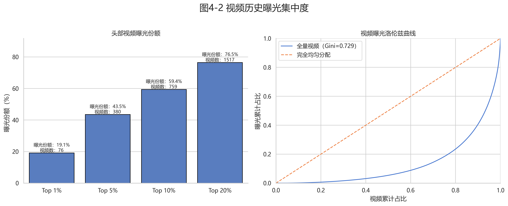
- 视频流量明显向头部集中：全量视频中，Top 20%视频获得76.5%的历史曝光，Gini系数为0.729

### 3）视频历史观看与互动反馈
对达到历史曝光 P30 门槛的视频，进一步比较有效观看率、长播放率、完播率以及点赞、评论、关注等反馈指标。

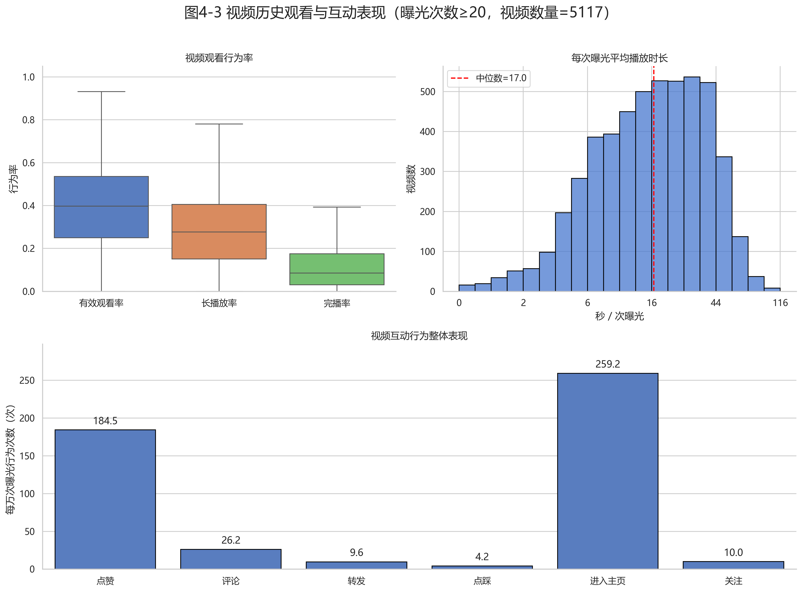
- 达到最低曝光门槛的视频中，有效观看率、长播放率和完播率中位数依次为39.7%、27.6%和8.6%，观看要求越深，达到的比例越低；
- 互动行为主要集中在主页进入和点赞，评论及其余行为明显更少。

### 4）视频历史分层
基于历史窗口中的历史曝光规模与综合表现构建二维视频分层。
1. 首先以有历史曝光视频曝光次数的P30作为最低观测门槛，筛选正式分层样本，其余视频保留为低样本或零曝光类型；
2. 使用历史曝光次数衡量视频曝光规模，使用观看表现与互动表现共同衡量视频获得曝光后的视频历史表现；
3. 以exposures与performance_score的P70作为高水平切点，将正式分层视频划分为四种类型。

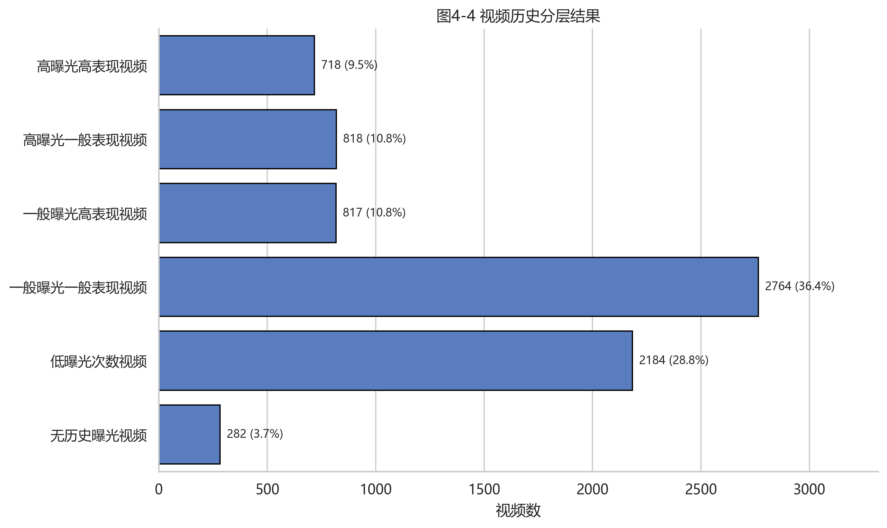
---

## 作者侧

### 5）作者作品供给与历史曝光

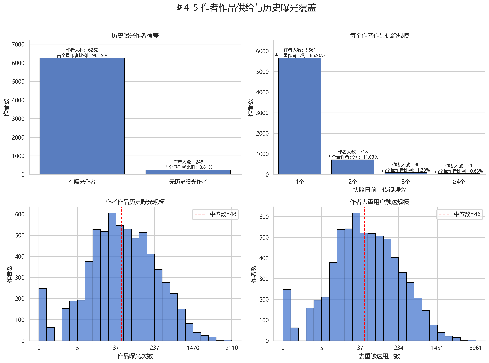
- 6510个全量作者中，96.2%的作者作品获得过历史曝光，87.0%的作者只上传1个视频；
- 作者总曝光次数和触达用户数呈明显长尾分布，说明作者之间差异主要表现在作品获得的流量而不是作品发布数量；

### 6）作者作品供给与历史曝光集中度

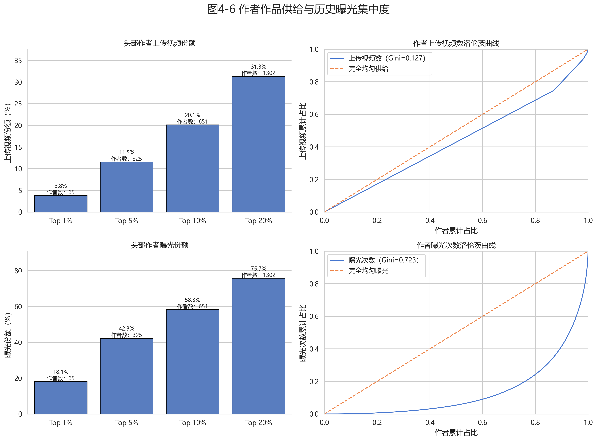
- 作者上传视频数较为均衡：作者上传视频数Gini仅为0.127，与前面分析得到大部分作者只上传1个视频的结论相符；
- 作者曝光次数明显向头部集中：作者作品曝光Gini达到0.723，Top 20%作者获得75.7%的曝光，说明本数据集历史曝光明显集中在少数作者的作品上。（由于约 87% 的作者只上传了 1 个视频，作者侧的曝光分布在很大程度上会受到其单个视频曝光表现的影响，因此作者与视频的曝光集中度结果较为接近。）

### 7）作者作品历史观看与互动表现
对达到作者作品历史曝光 P30 门槛的作者，分析其作品整体观看和互动反馈。

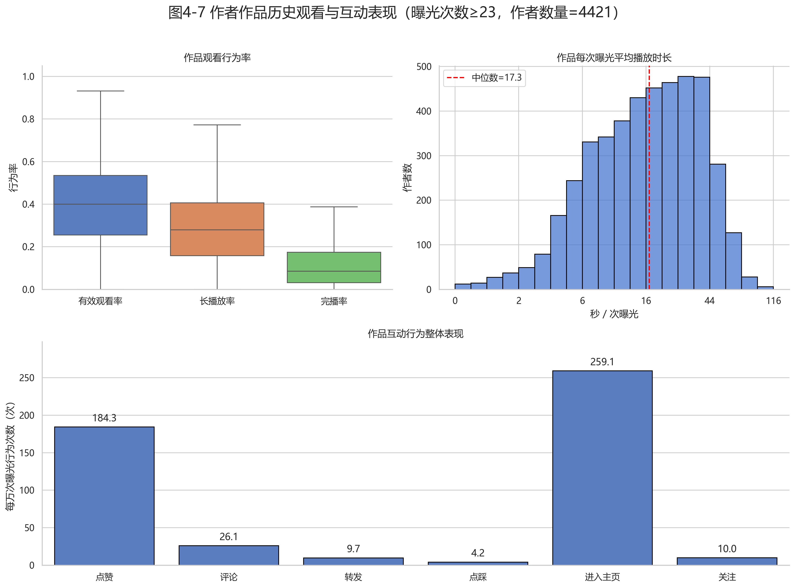
- 达到最低曝光门槛的作者中，作品有效观看率、长播放率和完播率中位数分别约40.0%、28.0%和8.6%，与视频侧整体表现接近；
- 作者作品平均每次曝光的播放时长中位数为17.3s，与视频级表现（17s）也基本一致；
- 用户互动行为同样主要集中在主页进入和点赞，其余互动行为较为稀疏；


### 8）作者历史观看与互动表现分层
基于历史窗口中作者作品的观看表现与互动表现构建二维作者分层。
1. 首先以作者作品累计历史曝光次数的P30作为最低观测门槛，筛选正式分层作者，其余作者保留为低曝光次数或零曝光类型；
2. 分别根据作者历史的观看行为指标与互动行为指标构建view_score与interaction_score，用于区分作者作品在观看和互动反馈两方面的表现；
3. 采用view_score与interaction_score各自P70作为高水平切点，将正式分层作者划分为四种类型。

- 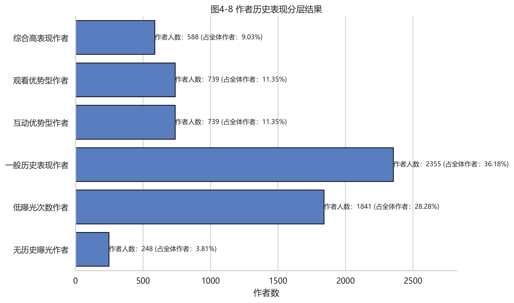

### 9）Phase 4 结论

Phase 4 的主要发现是：

- 视频历史曝光具有明显集中性，少数视频获得了大部分历史曝光；
- 作者作品曝光也呈现高度集中，但作者侧结果与视频侧高度相似，与多数作者只有一个视频的数据结构有关；
- 视频和作者的历史分层为 Phase 5 进一步分析不同历史状态下的曝光与反馈差异提供了统一标签。

---

# 5. Phase 5 标准推荐与随机曝光的视频曝光分配及用户反馈差异分析
基于同一时期的 `standard_post` 和 `random_post` 交互日志，并结合 Phase 3、Phase 4 得到的历史用户、视频和作者分层，比较两种曝光来源下的视频曝光分配，以及对于同一批用户和同一批视频的观看、互动反馈差异。
> 对应 SQL：[`06_Phase5_ADS_standard_random_analysis.sql`](../sql/06_Phase5_ADS_standard_random_analysis.sql)
> 
### 1）比较方法

#### 用户反馈差异分析：
- 对于观看率、互动率等反馈指标，分别从用户和视频两个角度进行配对比较；
- 为保证两边具有可比性，只保留同时出现在 `standard_post` 和 `random_post` 日志中的用户或视频；同时，为减少曝光次数过少导致行为率波动大，要求比较对象在两种曝光来源下的曝光次数都达到对应的 P30 门槛；
- 具体分析方法：
```text
使用 Wilcoxon 配对符号秩检验判断两种曝光来源下的指标差异是否具有统计稳定性；
使用 rank-biserial 衡量差异方向和大小；
对同一组中的多个指标使用 BH-FDR 进行多重比较校正。
```
#### 视频曝光分配差异分析：
- 分析“不同视频获得了多少曝光”（不设置 P30 曝光门槛）；
- 直接比较各类视频在 `standard_pre`、`standard_post` 和 `random_post` 中实际获得的曝光份额，不进行 Wilcoxon 等显著性检验。
---

## 用户侧差异分析
### 2）对于同一批用户，两种曝光来源下的反馈差异
后期窗口共有 25846 名用户同时接收到两种曝光来源，其中 18368 名用户达到双侧曝光次数门槛。

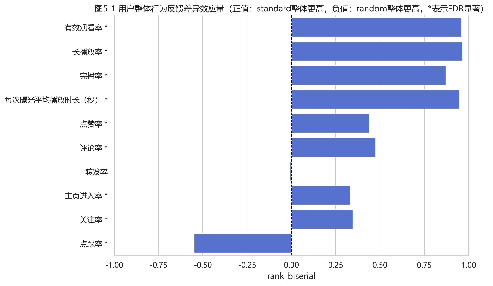
- `standard` 下有效观看率、长播放率、完播率和每次曝光平均播放时长等观看指标均显著更优；
- `standard` 下点赞、评论、主页进入、关注、点踩率等互动指标也更优；
- 转发率未表现出稳定显著差异；
- 观看指标的效应量整体强于互动指标。

### 3）不同历史用户类型的反馈差异

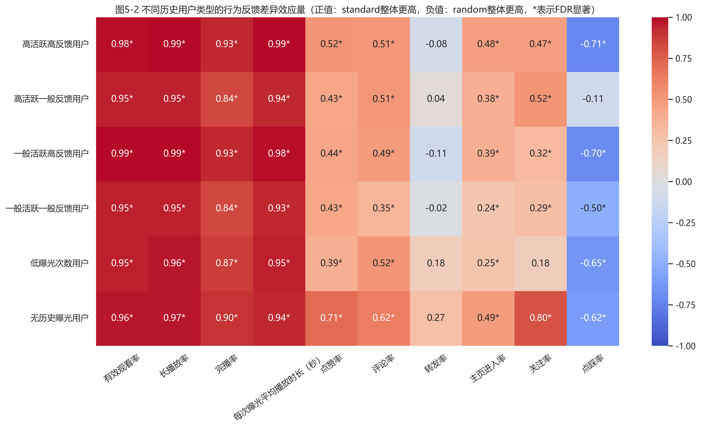
- `standard` 下6类用户类型有效观看率、长播放率、完播率和每次曝光平均播放时长等观看指标均显著更优（与用户整体差异一致）；
- 6类用户的转发率均未表现出稳定显著差异；
- `standard` 下6类用户类型点赞率、评论率和主页进入率均显著更优。除高活跃一般反馈用户外，其余5类用户的点踩率均显著在`standard`下更优；
- 总体来看，观看指标的效应量仍整体强于互动指标。不同历史用户类型并没有改变 `standard` 在观看反馈上的总体优势，但互动行为之间存在一定差异。


### 4）对于同一批用户，两种曝光来源下接收到的视频构成

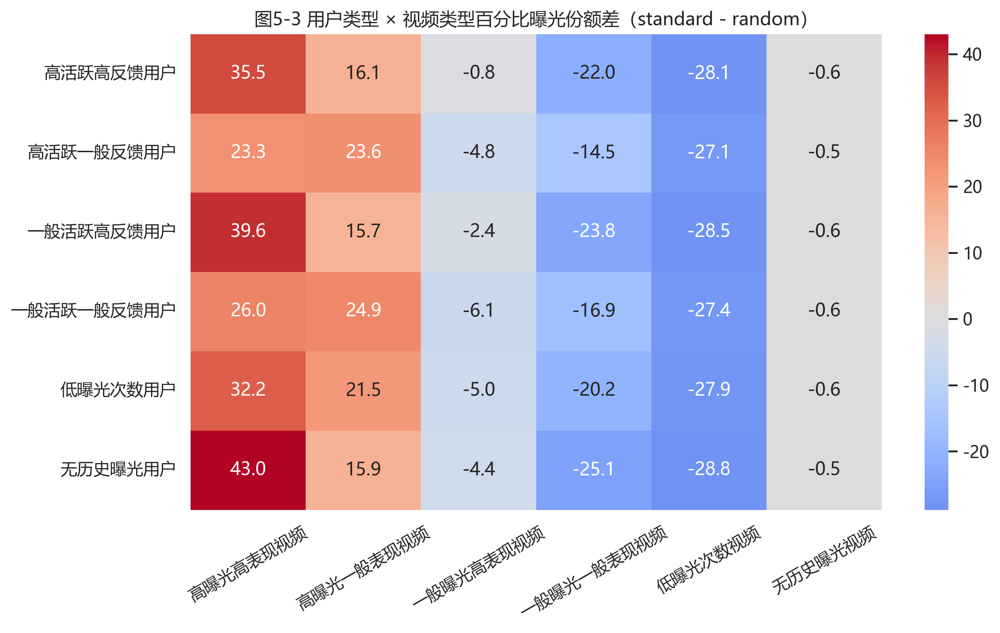
- 6类用户均呈现一致的视频曝光分布：`standard`下历史高曝光视频的份额更高，而`random`中一般曝光、低曝光和无历史曝光视频的份额更高；
- 其中，`standard` 对“高曝光高表现视频”的曝光份额优势最明显，各类用户中均高出约 23～43 个百分点；相反，“低曝光次数视频”在 `random` 中的曝光份额均明显更高，差异约为 27～29 个百分点；
- 说明相较于`random`，`standard`的曝光更集中于历史窗口中已经获得较多曝光的视频，而 `random` 明显扩大了对历史一般曝光和低曝光视频的覆盖。这与正常推荐系统进行视频选择、而随机干预从候选范围中随机抽取视频的机制相一致。
- 两种曝光来源下实际看到的视频结构不同，因此视频曝光分配差异可能解释部分用户反馈差异；但后续固定同一批视频后，观看反馈差异仍然存在，说明视频结构并不能解释全部差异。

## 视频侧

### 5）对于同一批视频，两种曝光来源下的用户反馈差异
后期共有 6,428 个视频同时出现在两种曝光来源中，其中 4,626 个视频达到双侧曝光次数门槛。

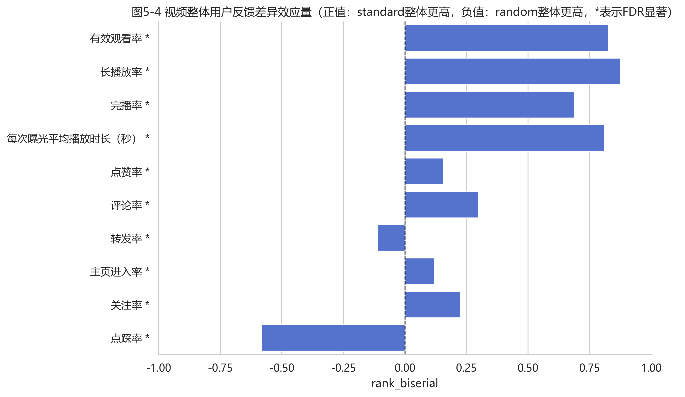
- `standard` 下有效观看率、长播放率、完播率和每次曝光平均播放时长等观看指标均显著更优；
- 点赞率、评论率、主页进入率和关注率整体偏向 `standard`，点踩率在 `standard` 下更低；转发率的均值差与 rank-biserial 方向不一致，因此不简单判断哪种曝光来源更优；
- 比较同一批视频，观看、互动指标的差异仍然存在。说明用户接收到的视频结构差异不足以完全解释用户的反馈差异。

### 6）不同历史视频类型的用户反馈差异

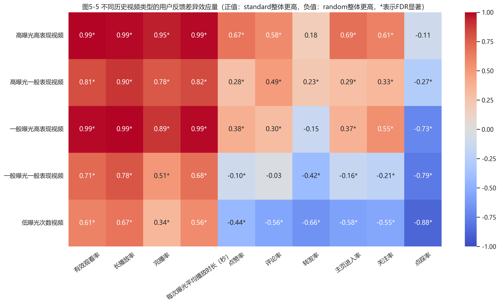
- 除无历史曝光视频因有效样本仅 1 个而不作分析外，`standard` 其余 5 类历史视频分层的有效观看率、长播放率、完播率和每次曝光平均播放时长均显著更优（与视频整体差异一致）；
- 用户互动反馈明显受到视频类型影响：高曝光或高表现视频中， `standard`下除转发率外其余行为指标均更优；而一般曝光一般表现视频和低曝光次数视频中，`random`下多项互动指标反而更优 ；
- 各视频类型的用户互动反馈存在明显差异。

### 7）不同历史视频类型在后期两种曝光来源下的曝光分配
比较三个时间窗口中各历史视频类型的曝光份额。

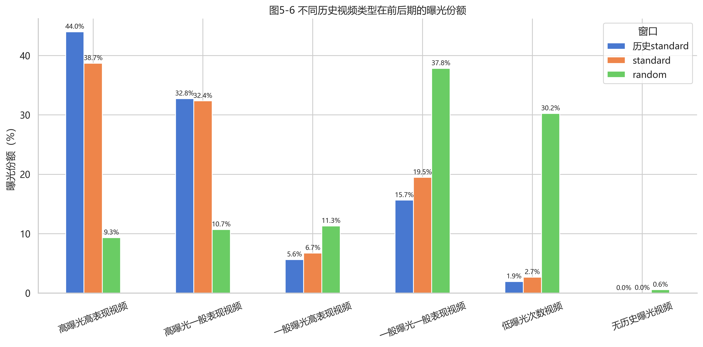
- `standard_post` 与历史 `standard_pre` 的视频曝光结构整体较为接近：两类历史高曝光视频在 `standard_pre` 中合计获得约 76.8% 的曝光，在 `standard_post` 中仍占约 71.1%，依然是主要曝光对象；
- `random_post` 的曝光结构则明显不同：两类历史高曝光视频的合计曝光份额下降至约 20.0%，而一般曝光一般表现视频和低曝光次数视频的曝光份额分别上升至 37.8% 和 30.2%；
- 总体来看，`standard_post` 的曝光分布与历史窗口比较接近，而 `random_post` 明显增加了对一般曝光和低曝光视频的覆盖。

## 作者侧

### 8）不同历史作者类型的作品曝光份额
一次曝光实际是把某个视频展示给用户，作者本身并不会被单独「曝光」。作者的观看率、互动率等指标本质上也是由其作品表现汇总得到。由于本数据集中约 87% 的作者只有 1 个视频，如果再比较作者侧的观看和互动反馈，结果会和视频侧高度重复。因此，Phase 5 作者侧只比较不同历史作者分层作品在 `standard` 和 `random` 中获得的曝光份额，不再单独做作者反馈差异分析。

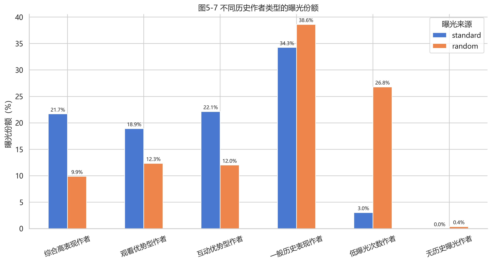
- `standard`下综合高表现、观看优势型和互动优势型作者的曝光份额均高于`random`；
- `random`中低曝光次数作者、一般历史表现作者的作品曝光份额均高于`standard`；
- 作者侧的曝光分配方向与视频侧较为接近：`standard`对历史曝光较充分或表现较好的作者作品分配了更高曝光份额，而`random`对历史低曝光作者作品的覆盖更多。由于约 87% 的作者仅上传 1 个视频，且作者与视频分层使用的核心历史指标相近，因此作者侧结果与视频侧存在较强对应关系。

### 9）Phase 5 综合结论

**1. `standard` 与 `random` 的视频曝光分配明显不同。**
- 从整体曝光看，`standard_post` 与 `standard_pre` 的视频曝光结构比较接近，两类历史高曝光视频在 `standard_post` 中仍占约 71.1% 的曝光；而在 `random_post` 中，两类历史高曝光视频的合计份额下降至约 20.0%，一般曝光和低曝光视频获得了更多曝光；
- 对于同一批用户也能观察到相同方向：`standard` 下用户更多接触历史高曝光视频，`random` 下则更多接触一般曝光和低曝光视频。作者侧结果与视频侧也较为接近。

**2. 对于同一批用户，`standard` 下的观看反馈整体更好，而且这一结果在不同历史用户类型也同样呈现。**
- 对 18368 名达到双侧曝光门槛的用户进行配对比较后，`standard` 下只有转发率未表现出稳定显著差异，其他观看、互动指标均显著更优。

**3. 对于同一批视频，`standard` 下的用户反馈优势仍然存在。**
- 对 4626 个达到双侧曝光门槛的视频进行配对比较后，除了转发率在`random`下显著更优外，其他观看、互动指标均在`standard` 下显著更优；
- 因此，结论1中的视频曝光分配差异，不能完全解释结论2得到的用户反馈差异。

**4. 不同历史视频类型的互动反馈结果并不一致。**

- 对于历史高曝光或高表现视频，多项行为互动指标在`standard下`表现更优；而对于一般曝光一般表现视频和低曝光次数视频，多项行为互动指标在`random`下表现更优。

**5. 上述结果不能直接说明 `standard` 本身造成了更好的反馈。**

- 当前 `standard` 与 `random` 并不是严格随机分组，实际出现的用户—视频组合也并不完全一致，因此目前只能说明两种曝光来源下存在稳定的关联差异。
- 如果要进一步验证曝光方式本身是否造成反馈差异，需要通过随机 A/B Test 进行因果验证。

**6. 综合来看，两种曝光方式形成了明显不同的用户—视频匹配结果。**

- `standard`下用户更多接触到历史上已经获得较多曝光的视频和作者作品，`random`则让更多历史曝光较少的视频获得展示机会；
- 用户最终产生的观看和互动反馈，不仅和视频本身有关，也会受到曝光方式以及实际触达的用户构成影响；
- 因此，只根据`standard`历史日志中的曝光量和反馈结果，不能直接把“曝光少、反馈低”理解为视频本身质量差。

---

# 6. Phase 6｜`long_view` 预测
从 `standard_post` 中整理预测样本，并关联 `standard_pre` 中已经得到的用户和视频历史特征，为后续模型训练准备数据。
> 对应 SQL：[`07_Phase6_ADS_long_view_sample.sql`](../sql/07_Phase6_ADS_long_view_sample.sql)

### 1）预测任务
- 利用standard_pre中的用户历史行为、视频历史表现、用户—视频兴趣匹配及当前视频属性（特征），预测standard_post中一次用户—视频曝光是否产生long_view（标签）。

```text
输入：
standard_pre 用户历史特征
+
standard_pre 视频历史特征
+
用户历史偏好与 standard_post 当前视频标签匹配
+
standard_post 当前视频基础特征

↓

预测：
standard_post 交互日志中的一次曝光是否产生 long_view
```

### 2）数据划分
共得到 284321 条 `standard_post` 视频曝光样本。为了使训练集、验证集和测试集中的 `long_view` 正负样本比例保持基本一致，按照 `long_view` 标签进行样本随机划分：

```text
Train       170,592   约60%
Validation   56,864   约20%
Test         56,865   约20%
```

训练集用于模型训练，验证集用于选择分类阈值，测试集只用于最终评价。

### 3）验证集阈值选择
- 模型在验证集上的 ROC-AUC 为 **0.7339**，说明模型对 `long_view` 正负样本具备一定区分能力；
- 继续在验证集上比较不同二分类阈值对应的 Precision、Recall 和 F1，确定最终分类阈值：
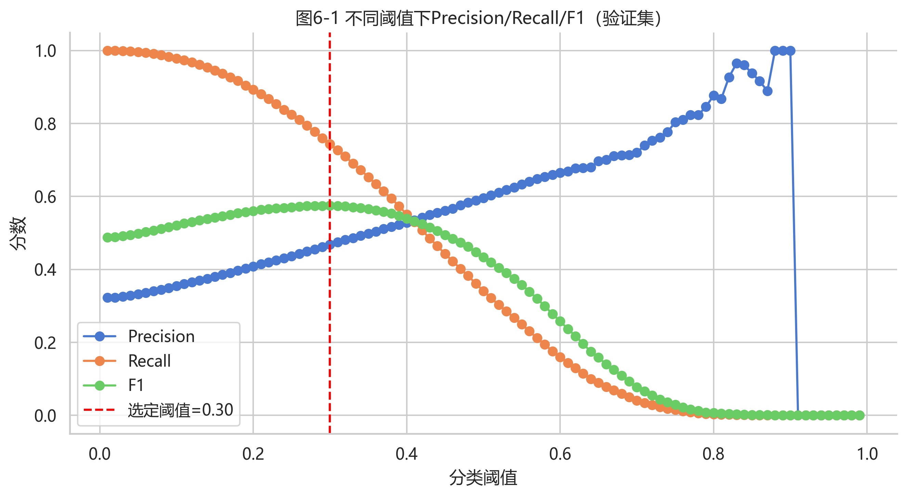
验证集F1在阈值0.30时最高，为0.5751；对应Precision为0.4687、Recall为0.7441，因此固定0.30作为最终分类阈值。

### 4）测试集结果

- 在测试集上，先使用用户历史 `long_view_rate` 作为简单基线，衡量只依赖单一历史用户行为时的预测效果。
- 随后使用前面已经确定好的 LightGBM 模型和分类阈值，在测试集上进行最终评估。

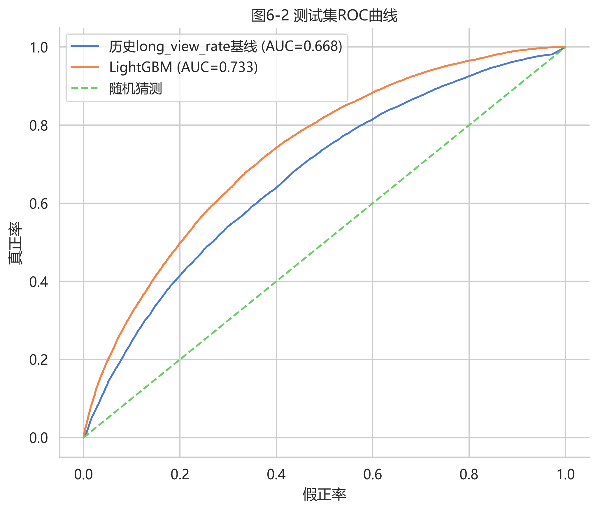
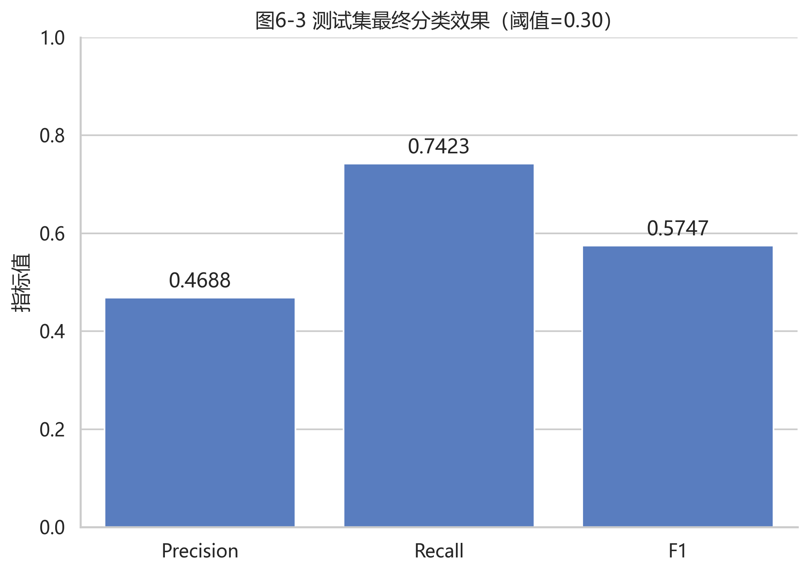
- 测试集正样本率为32.24%。仅使用用户历史long_view_rate的baseline ROC-AUC为0.6684。LightGBM为0.7329，较baseline高0.0645。
- 使用验证集选定的0.30阈值后，测试集Precision为46.88%、Recall为74.23%、F1为0.5747，Lift为1.4541。接近一半判断正确，整体分类效果较为稳定。

---

# 7. 项目总结

本项目围绕 KuaiRand-Pure 推荐日志，完成了从原始数据处理、历史行为分析，到 `standard` / `random` 对比分析和 `long_view` 预测的完整流程：


```text
Phase 1
理解原始数据与质量检查
↓
Phase 2
建立 ODS / DWD / DWS 分层数仓建设
↓
Phase 3
用户历史画像、视频标签偏好与用户分层
↓
Phase 4
视频 / 作者历史曝光、反馈表现与分层
↓
Phase 5
standard / random 视频曝光分配与用户反馈差异分析
↓
Phase 6
基于历史特征预测 long_view
```

其中最核心的业务发现是：

1. 历史视频曝光具有明显集中性。 视频历史曝光 Gini 约为 0.729，Top 20% 视频获得约 76.5% 的历史曝光，说明历史曝光主要集中在少数视频上；
2. `standard` 与 `random` 的视频曝光分配明显不同。 `standard_post` 的曝光结构与历史 `standard_pre` 较为接近，仍主要曝光历史高曝光视频；`random_post` 则明显增加了一般曝光和低曝光视频的曝光机会。作者侧也表现出相似的分配差异；
3. 对于同一批用户，standard 下的观看与互动反馈整体更好，但互动指标的整体效应量弱于观看指标。
4. 固定同一批视频后，用户的反馈差异仍然存在。 说明两种曝光来源展示的视频结构不同，可以解释部分反馈差异，但不能解释全部差异。同时，不同历史视频类型的用户互动反馈方向并不一致；
5. 两种曝光来源形成了明显不同的用户—视频匹配结果。 `standard` 下用户更多接触历史上已经获得较多曝光的视频和作者作品，`random` 则让更多历史曝光较少的视频获得展示机会。因此，只根据历史正常推荐日志中的曝光量和反馈结果，不能直接把“曝光少、反馈低”理解为视频本身质量差。
6. `random` 让更多历史低曝光视频获得了展示机会，但不能说明这些视频是因为 `random` 才表现得更好。`random` 明显增加了历史一般曝光和低曝光视频的展示机会，而且其中部分视频在 `random` 下的互动反馈更好，说明历史曝光较少并不一定代表视频本身表现较差。但由于 `standard` 与 `random` 下实际出现的用户—视频组合并不完全一致，不能进一步认为是 `random` 本身让这些视频表现变好；如果要验证曝光方式是否直接造成反馈差异，仍需要通过随机 A/B Test 进行验证。
7. 使用用户历史行为、视频历史表现和兴趣匹配等特征构建的 LightGBM，预测效果高于单一用户历史 long_view_rate 基线。 LightGBM 在测试集上的 ROC-AUC 为 0.7329，高于单一用户历史 long_view_rate 基线的 0.6684；使用验证集选定的 0.30 阈值后，测试集 Recall 为 74.23%、F1 为 0.5747、Lift 为 1.4541。